### <code>patrick@github:~$ whoami</code>

<table>
  <tr>
    <td valign="top" width="460">
      
    </td>
    <td valign="top" width="520">
      
    </td>
  </tr>
</table>

 

### <code>patrick@github:~$ ./contributions</code>

 

### <code>patrick@github:~$ _</code>

<!--
Local regeneration:
1. Place or replace your portrait photo at assets/input/portrait.jpg
2. Install dependencies: python -m pip install -r scripts/requirements-portrait.txt
3. Fetch data: python scripts/fetch_contributions.py --username pml0107
4. Regenerate assets: python scripts/build_profile.py
-->
